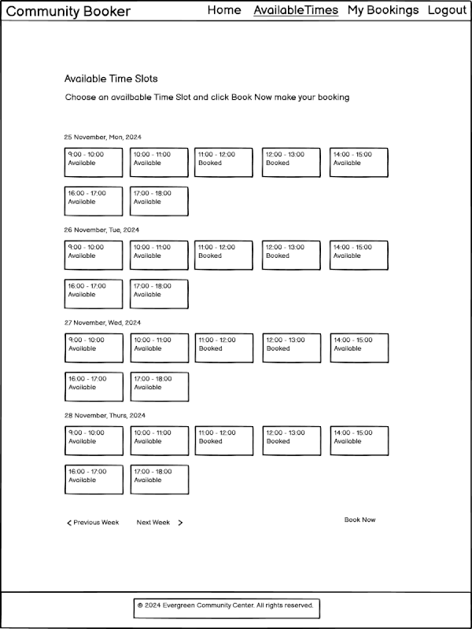

## Community Booker App
A simplified platform to manage and book time slots for community centers.

#### Table of Contents


###  1. Project Overview
The Community Booker App simplifies the process of booking and managing community center resources. Designed with user-friendliness and efficiency in mind, it caters to community centers, event organizers, and local residents.

------

### 2. Agile Methodology
In this project, I followed Agile practices to ensure incremental progress and iterative feedback. The development was organized into user stories, and tasks were tracked using a project board.

#### User Stories
Here are some of the key user stories for the project:
- As a **Site User** I can **register an account** so that **I can make a booking**
- As a **logged in user** I can **create a booking** so that **I can reserve a spot for my event**
- As an **admin** I can **create, update, and delete time slots for my community center** so that **users can book them**
- As a **user** I can **see all available time slots for the community center** so that **I can choose a convenient time to book**
- As a **logged in user** I can **view a list of my bookings** so that **I can keep track of the times I have reserved for the community center**
- As a **logged in user** I can **edit an upcoming booking** so that **I can update the occasion or reschedule to a different time slot**
- As a **logged in user** I can **cancel an upcoming booking** so that **the time slot becomes available for others**

#### Project Board
All the tasks, user stories, and issues were tracked on the project board. You can check out the project board for the latest updates and progress:

[Link to Project Board](https://github.com/users/Taybe2/projects/5/views/1)

------

### 3. Features
- **User Autentication:** Users can register, log in, reset their password, and manage their bookings, including checking past or upcoming bookings and editing or deleting them.
- **Booking System:** Allows users to view available time slots and book them instantly.
- **Admin Panel:** Django's built-in admin panel allows community center admins to manage bookings, update center details, and generate time slots.
- **Homepage:** Features a hero image with call-to-action button for quick access to Available Time Slots and Community Centre Details.
- **My Bookings Page:** Users can view, edit, or cancel their bookings.
- **Resposive Design:** Optimized for both desktop and mobile devices.

------
### 4. Wireframes
The wireframes below depict the initial design concepts of the Community Booker App, showcasing the layout and flow of key pages such as the homepage, booking page, and user management pages.

#### Key Screens

- **Homepage:** Features a hero image with call-to-action buttons for quick access to available time slots and community center details.


- **Available Time Slots Page:** Displays the available time slots for booking, organized from tomorrow onward.



- **My Bookings Page:** Allows users to view their bookings, with options to edit or cancel.


- **Confirm Booking Page:** Allows users to provide booking details, such as occasion type and notes, before finalizing their booking.


#### File location
The wireframes for all pages are consolidated in a single PDF file for easy reference. You can find the file in the *docs/wireframes/* directory of this repository. The file is named *wireframes.pdf*.

#### Tools Used
These wireframes were created using Balsamiq, a user-friendly tool for creating low-fidelity wireframes that help visualize and plan application designs.

#### Note on Iterations
The wireframes served as the foundation for the app's UI design. Some elements have been refined during implementation to improve user experience.

------

### 5. Entity Relationship Diagram (ERD)
The Entity Relationship Diagram (ERD) outlines the database structure for the Community Booker App, showing how data entities relate to one another.

**ERD Overview:**
- **Users:** Represents authenticated users who can book the community center. The app utilizes Django's built-in User model, which provides essential functionality for handling user authentication, such as registration, login, and password management.
- **Bookings:** Stores details of each booking made by users.
- **CommunityCentre:** Holds information about the community center, such as name, address,featured image and operating hours.
- **TimeSlots:** Represents the available time slots at the community center for booking, including the start and end time for each slot.

Below is the Entity Relationship Diagram (ERD) that shows the structure of the database:


------

### 6. Technologies Used
- **Back-end:** Django 4.x, Python 3.x
- **Front End:** HTML5, CSS3, JavaScript
- **database:** SQLite (for development), PostgreSQL (for production)
- **Hosting:** Heroku
- **Media Storage:** Cloudinary
- **Tools:** Bootstrap, Django Crispy Forms

------

### 7. Installation Instructions
  1. Clone the repository:
  ```bash
  git clone https://github.com/Taybe2/community-booker.git
  cd community-booker
  ```
  2. Create a virtual environment and activate it:
  ```bash
  python -m venv env
  source env/bin/activate  # On Windows: env\Scripts\activate
  ```
  3. Install dependencies:
  ```bash
  pip install -r requirements.txt
  ```
  4. Apply migrations:
  ```bash
  python manage.py migrate
  ```
  5. Create a superuser for admin access:
  ```bash
  python manage.py createsuperuser
  ```
  6. Run the development server:
  ```bash
  python manage.py runserver
  ```

------

### 8. Usage Guide
This guide provides step-by-step instructions on how to use the Community Booker App effectively.
  
  #### 1. Accessing the Application
  - Open your browser and navigate to the app’s URL: <a href="https://community-booker-app-9f0552b871a8.herokuapp.com/" target="_blank">Community Booker App</a>
  - You’ll be greeted with the homepage featuring a hero image and call-to-action button for quick navigation.
  - You will also see the Community Centre's details, including its address, opening hours, and operating days.
  
  #### 2. Registering an Account
  - Click on the Sign Up link in the navigation menu.
  - Fill out the registration form with your details (e.g., username, email, password).
  - Submit the form to create your account.
  - After registering, you can log in using your credentials.

  #### 3. Logging In
  - Click on the Log In link in the navigation menu.
  - Enter your username and password.
  - Click Sign In to access the My Bookings page, where you can view your bookings or make a new one.

  #### 4. Viewing Available Time Slots
  - Click on the Available Time Slots link in the navigation menu.
  - View the available time slots, starting from tomorrow, organized by date and time.
  - Use the Next 10 Days or Previous 10 Days buttons to navigate between dates.
  - To book a slot, you must first log in or register.

  #### 5. Making a Booking
  - Go to the Available Time Slots page and browse the available slots.
  - Select an available time slot by clicking on it.
  - Click the Book Selected Time Slot button to go to the booking page.
  - Fill in the booking details, including: Occassion, Occasion Type(Private/Public) and Notes(optional)
  - Choose whether you want your booking to be Public (viewable by others) or Private (not viewable by others).
  - After filling in all the details, click Confirm Booking to complete the booking process.

  #### 6. Managing Your Booking
  - Navigate to the "My Bookings" page from the navigation menu.
  - View all your bookings categorized as Upcoming or Past.
  - For **Upcoming Bookings**:
    - Edit the booking details using the Edit Booking button.
    - Cancel a booking using the Cancel Booking button.
  
  #### 7. Editing an Upcoming Booking
  - Navigate to the My Bookings page from the navigation menu.
  - Find the booking you want to edit.
  - Click the Edit button next to the booking.
  - Modify the details of your booking, such as the occasion name, type, or notes.
  - To change the time and/or date of your booking, click the Change Time Slot link.
  - You will be navigated to the Choose a Different Time Slot (Reschedule) page, where you can select a new time slot for your booking.
  - Once you've made the changes, click Save Changes to update your booking.

####  8. Logging Out
  - Click on the "Logged in as [username]" text in the navigation menu
  - A dropdown menu will appear with the option "Logout".
  - Click "Logout" to be redirected to the Sign Out page.
  - On the Sign Out page, you will be asked if you're sure you want to sign out.
  - Click the "Sign Out" button to complete the logout process.

------

### 9. Screenshots

------

### 10. Testing

------

### 11. Deployment
The Community Booker app is hosted on Heroku. Below are the steps to deploy it using the Heroku Dashboard:

**Prerequisites**
1. Ensure you have a Heroku account.
2. Make sure your project code is pushed to a GitHub repository.

**Steps to Deploy via Heroku Dashboard**
1. Log In to Heroku
    - Navigate to Heroku and log in to your account.
2. Create a New Heroku App
    - Click the New button in the top-right corner of the dashboard.
    - Select Create new app.
    - Provide a unique name for your app (e.g., community-booker) and choose your region.
    - Click Create app.
3. Connect the App to GitHub
    - On the app’s dashboard, go to the Deploy tab.
    - In the Deployment Method section, select GitHub.
    - In the Config Vars section, click Reveal Config Vars.
    - Add the required environment variables, such as:
      ```
      SECRET_KEY=<your-secret-key>
      DATABASE_URL=<your-database-url>
      CLOUDINARY_URL=<your-cloudinary-url>
      ```
    - If DISABLE_COLLECTSTATIC=1 was previously added, delete it once your static files are correctly configured. This will allow Heroku to run collectstatic during deployment.
4. Manual Deployment
    - If you want to deploy manually, scroll to the Manual Deploy section on the Deploy tab.
    - Choose the branch you want to deploy (e.g., main) and click Deploy Branch.
    - Wait for Heroku to build and deploy your app.
5. Access Your Deployed App
    - Once the deployment is complete, you will see a confirmation message with a link to your app.
    - Click the link to access your app in the browser.

**Notes**
  - Make sure DEBUG in settings.py is set to False for production.


------

### 12. Future Enchancements
#### 1. Multiple Community Centers Support
  Allow the app to support multiple community centers, where each center can have its own settings, time slots, and bookings. This will allow the platform to be used by various community centers, making it more scalable.

#### 2. Recurring Bookings
  Add support for recurring bookings, where users can book a time slot on a weekly, monthly, or custom repeating schedule.

#### 3. Payment Integration
  Add support for online payments for bookings (if applicable), allowing users to pay for their booking directly through the app.

#### 4. Admin Booking Approval
  Introduce a booking approval system where admins must review and approve or reject bookings before they are finalized. This ensures better control over the scheduling process and prevents conflicts or unauthorized bookings.

------

### 13. Contributing

------

### 14. License

------

### 15. Aknowledgements

To run a frontend (HTML, CSS, Javascript only) application in Gitpod, in the terminal, type:

`python3 -m http.server`

A blue button should appear to click: _Make Public_,

Another blue button should appear to click: _Open Browser_.

To run a backend Python file, type `python3 app.py` if your Python file is named `app.py`, of course.

A blue button should appear to click: _Make Public_,

Another blue button should appear to click: _Open Browser_.

By Default, Gitpod gives you superuser security privileges. Therefore, you do not need to use the `sudo` (superuser do) command in the bash terminal in any of the lessons.

To log into the Heroku toolbelt CLI:

1. Log in to your Heroku account and go to *Account Settings* in the menu under your avatar.
2. Scroll down to the *API Key* and click *Reveal*
3. Copy the key
4. In Gitpod, from the terminal, run `heroku_config`
5. Paste in your API key when asked

You can now use the `heroku` CLI program - try running `heroku apps` to confirm it works. This API key is unique and private to you, so do not share it. If you accidentally make it public, you can create a new one with _Regenerate API Key_.

### Connecting your Mongo database

- **Connect to Mongo CLI on a IDE**
- navigate to your MongoDB Clusters Sandbox
- click **"Connect"** button
- select **"Connect with the MongoDB shell"**
- select **"I have the mongo shell installed"**
- choose **mongosh (2.0 or later)** for : **"Select your mongo shell version"**
- choose option: **"Run your connection string in your command line"**
- in the terminal, paste the copied code `mongo "mongodb+srv://<CLUSTER-NAME>.mongodb.net/<DBname>" --apiVersion 1 --username <USERNAME>`
  - replace all `<angle-bracket>` keys with your own data
- enter password _(will not echo **\*\*\*\*** on screen)_

------

## Release History

We continually tweak and adjust this template to help give you the best experience. Here is the version history:

**June 18, 2024,** Add Mongo back into template

**June 14, 2024,** Temporarily remove Mongo until the key issue is resolved

**May 28 2024:** Fix Mongo and Links installs

**April 26 2024:** Update node version to 16

**September 20 2023:** Update Python version to 3.9.17.

**September 1 2021:** Remove `PGHOSTADDR` environment variable.

**July 19 2021:** Remove `font_fix` script now that the terminal font issue is fixed.

**July 2 2021:** Remove extensions that are not available in Open VSX.

**June 30 2021:** Combined the P4 and P5 templates into one file, added the uptime script. See the FAQ at the end of this file.

**June 10 2021:** Added: `font_fix` script and alias to fix the Terminal font issue

**May 10 2021:** Added `heroku_config` script to allow Heroku API key to be stored as an environment variable.

**April 7 2021:** Upgraded the template for VS Code instead of Theia.

**October 21 2020:** Versions of the HTMLHint, Prettier, Bootstrap4 CDN and Auto Close extensions updated. The Python extension needs to stay the same version for now.

**October 08 2020:** Additional large Gitpod files (`core.mongo*` and `core.python*`) are now hidden in the Explorer, and have been added to the `.gitignore` by default.

**September 22 2020:** Gitpod occasionally creates large `core.Microsoft` files. These are now hidden in the Explorer. A `.gitignore` file has been created to make sure these files will not be committed, along with other common files.

**April 16 2020:** The template now automatically installs MySQL instead of relying on the Gitpod MySQL image. The message about a Python linter not being installed has been dealt with, and the set-up files are now hidden in the Gitpod file explorer.

**April 13 2020:** Added the _Prettier_ code beautifier extension instead of the code formatter built-in to Gitpod.

**February 2020:** The initialisation files now _do not_ auto-delete. They will remain in your project. You can safely ignore them. They just make sure that your workspace is configured correctly each time you open it. It will also prevent the Gitpod configuration popup from appearing.

**December 2019:** Added Eventyret's Bootstrap 4 extension. Type `!bscdn` in a HTML file to add the Bootstrap boilerplate. Check out the <a href="https://github.com/Eventyret/vscode-bcdn" target="_blank">README.md file at the official repo</a> for more options.

------

## FAQ about the uptime script

**Why have you added this script?**

It will help us to calculate how many running workspaces there are at any one time, which greatly helps us with cost and capacity planning. It will help us decide on the future direction of our cloud-based IDE strategy.

**How will this affect me?**

For everyday usage of Gitpod, it doesn’t have any effect at all. The script only captures the following data:

- An ID that is randomly generated each time the workspace is started.
- The current date and time
- The workspace status of “started” or “running”, which is sent every 5 minutes.

It is not possible for us or anyone else to trace the random ID back to an individual, and no personal data is being captured. It will not slow down the workspace or affect your work.

**So….?**

We want to tell you this so that we are being completely transparent about the data we collect and what we do with it.

**Can I opt out?**

Yes, you can. Since no personally identifiable information is being captured, we'd appreciate it if you let the script run; however if you are unhappy with the idea, simply run the following commands from the terminal window after creating the workspace, and this will remove the uptime script:

```
pkill uptime.sh
rm .vscode/uptime.sh
```

**Anything more?**

Yes! We'd strongly encourage you to look at the source code of the `uptime.sh` file so that you know what it's doing. As future software developers, it will be great practice to see how these shell scripts work.

---

Happy coding!
