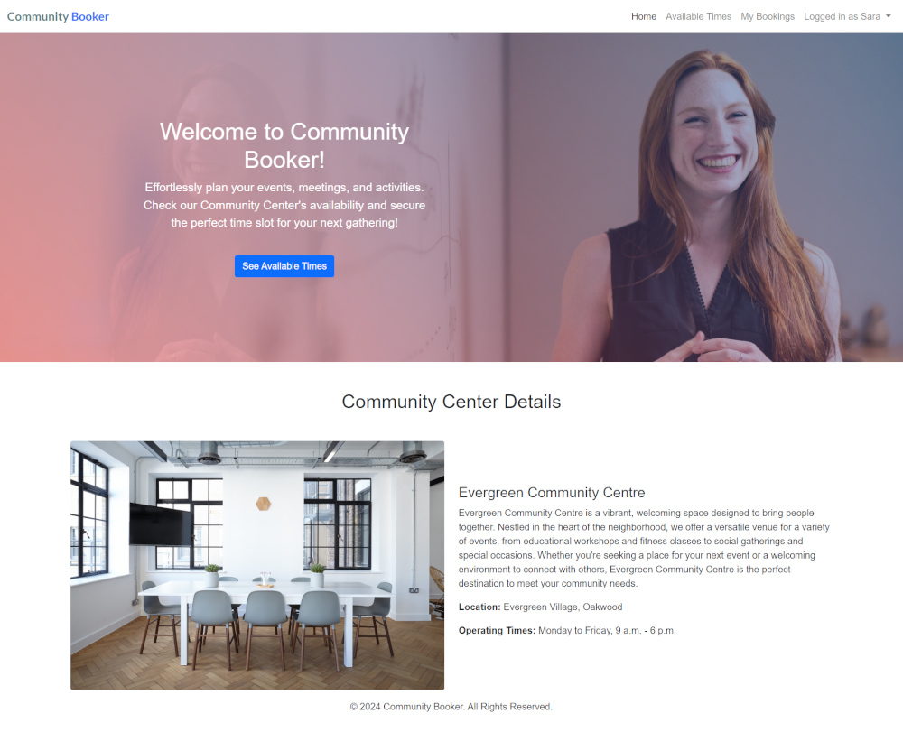

## Community Booker App
A simplified platform to manage and book time slots for community centers.
# **[Link to Live Site](https://community-booker-app-9f0552b871a8.herokuapp.com/)**  

#### Table of Contents
- [1. Project Overview](#1-project-overview)
- [2. User Experience Design](#2-user-experience-design)
- [3. Agile Methodology](#3-agile-methodology)
- [4. Features](#4-features)
- [5. Entity Relationship Diagram (ERD)](#5-entity-relationship-diagram-erd)
- [6. Technologies Used](#6-technologies-used)
- [7. Installation Instructions](#7-installation-instructions)
- [8. Usage Guide](#8-usage-guide)
- [9. Screenshots](#9-screenshots)
- [10. Testing](#10-testing)
- [11. Deployment](#11-deployment)
- [12. Future Enchancements](#12-future-enchancements)
- [13. Contributing](#12-future-enchancements)                      
- [14. Credits](#15-credits)

###  1. Project Overview
The Community Booker App simplifies the process of booking and managing community center resources. Designed with user-friendliness and efficiency in mind, it caters to community centers, event organizers, and local residents.

------

### 2. User Experience Design

#### Target Audience
This application is designed for:
- **Community Members**: Individuals looking to book a space for personal or group activities, such as meetings, classes, or events.
- **Community Center Administrators**: Staff managing bookings, ensuring optimal space utilization.

#### User Stories
Here are some of the key user stories for the project:
- As a **Site User** I can **register an account** so that **I can make a booking**
- As a **logged in user** I can **create a booking** so that **I can reserve a spot for my event**
- As an **admin** I can **create, update, and delete time slots for my community center** so that **users can book them**
- As a **user** I can **see all available time slots for the community center** so that **I can choose a convenient time to book**
- As a **logged in user** I can **view a list of my bookings** so that **I can keep track of the times I have reserved for the community center**
- As a **logged in user** I can **edit an upcoming booking** so that **I can update the occasion or reschedule to a different time slot**
- As a **logged in user** I can **cancel an upcoming booking** so that **the time slot becomes available for others**

#### Design Approach
- **Simplicity and Clarity**: The user interface features a clean layout with intuitive navigation to ensure ease of use.
- **Accessibility**: Designed with accessibility in mind, including sufficient color contrast, large clickable buttons, and clear text.
- **Responsiveness**: The application is fully responsive, providing a seamless experience across devices, including desktops, tablets, and mobile phones.

#### Key Design Features
1. **Navigation Bar**: Includes links to key pages such as "Available Time Slots" and "My Bookings," ensuring easy access to core functionality.
2. **Hero Image with CTA Buttons**: Featured on the homepage, guiding users to explore available slots or learn more about the community center.
3. **My bookings Page**: Displays upcoming and past bookings, with options to edit or cancel bookings.
4. **Available Time Slots Page**: Organized by date and time, with a "Book Now" button for quick action.

#### Wireframes
The initial design was created using wireframes to visualize the user flow and interface elements. These wireframes guided the development process to ensure alignment with user needs.

##### Key Screens

- **Homepage:** Features a hero image with call-to-action buttons for quick access to available time slots and community center details.


- **Available Time Slots Page:** Displays the available time slots for booking, organized from tomorrow onward.


- **My Bookings Page:** Allows users to view their bookings, with options to edit or cancel.


- **Confirm Booking Page:** Allows users to provide booking details, such as occasion type and notes, before finalizing their booking.


###### Tools Used
These wireframes were created using Balsamiq, a user-friendly tool for creating low-fidelity wireframes that help visualize and plan application designs.

##### Note on Iterations
The wireframes served as the foundation for the app's UI design. Some elements have been refined during implementation to improve user experience.

By centering the design process around user needs, this application aims to provide a seamless and enjoyable experience for both community members and administrators.

##### [ Back to Top ](#table-of-contents)

------

### 3. Agile Methodology

#### Iterative Development
The development process followed Agile principles, focusing on iterative progress and user-centric features. By breaking down the project into smaller, manageable tasks, each iteration delivered a functional aspect of the application.

#### GitHub Project Board
A GitHub Project Board was utilized to manage tasks and track progress throughout the development lifecycle. The board included the following columns:
- **To Do**: Tasks planned for the current iteration.
- **In Progress**: Tasks actively being worked on.
- **Done**: Completed tasks.

This approach ensured clear visibility of the project's status and helped prioritize work effectively.

#### Benefits of the Agile Approach
- **Flexibility**: Allowed adjustments to the scope and priorities as the project evolved.
- **Focused Delivery**: Kept development aligned with user stories to meet user needs effectively.
- **Task Tracking**: Provided a clear overview of progress and upcoming work.

Using GitHub Project Boards streamlined task management and ensured timely delivery of the Minimum Viable Product (MVP).

[Link to Project Board](https://github.com/users/Taybe2/projects/5/views/1)

##### [ Back to Top ](#table-of-contents)

------

### 4. Features

#### 1. **My Bookings**
  - **Description:** After logging in, users can view their bookings, which are grouped into "Upcoming Bookings" and "Past Bookings." Bookings are also paginated for easy navigation. Users can manage their existing bookings.
  - **Screenshots:**
  ##### Upcoming Bookings View
  
  ##### Past Bookings View:
  

#### 2. **Available Time Slots**
  - **Description:** Users can view available time slots for booking the community center. Time slots are displayed starting from tomorrow.
  - **Screenshots:**
  ##### Users can select a time slot for booking:
  
  ##### Users can navigate through different dates using the 'Previous 10 Days' and 'Next 10 Days' buttons:
  
  ##### Users can proceed with booking creation by clicking the 'Book Selected Time Slot' button:
  

#### 3. **Create a Booking**
   - **Description:** After selecting an available time slot users can create a booking for the community center.
   - **Screenshot:**  
   

#### 4. **Edit a Booking**
  - **Description:** Users can edit their upcoming bookings.
  - **Screenshots:**
  ##### Users can edit an upcoming booking:  
  
  ##### Users can select a new time slot for an upcoming booking:  
  

#### 5. **Booking Privacy Settings**
  - **Description:** Users can choose whether their booking is public (viewable by others) or private (not viewable by others).
  - **Screenshots:**  
  
  

#### 4. **Cancel (Delete) a Booking**
  - **Description:** Users can delete their upcoming bookings.
  - **Screenshot:**
  ##### Users can delete an upcoming booking:  
  

#### 7. **Admin Panel**
  - **Description:** Admins can manage the community center's data, bookings, and time slots through Django's built-in admin panel.
  - **Screenshots:** 
  ##### Admin can manage community centre details and generate time slots for it
  
  ##### Admin can manage bookings
  
  ##### Admin can manage time slots
  


##### [ Back to Top ](#table-of-contents)

------

### 5. Entity Relationship Diagram (ERD)
The Entity Relationship Diagram (ERD) outlines the database structure for the Community Booker App, showing how data entities relate to one another.

**ERD Overview:**
- **Users:** Represents authenticated users who can book the community center. The app utilizes Django's built-in User model, which provides essential functionality for handling user authentication, such as registration, login, and password management.
- **Bookings:** Stores details of each booking made by users.
- **CommunityCentre:** Holds information about the community center, such as name, address,featured image and operating hours.
- **TimeSlots:** Represents the available time slots at the community center for booking, including the start and end time for each slot.

Below is the Entity Relationship Diagram (ERD) that shows the structure of the database:


##### [ Back to Top ](#table-of-contents)

------

### 6. Technologies Used
- **Back-end:** Django 4.x, Python 3.x
- **Front End:** HTML5, CSS3, JavaScript
- **database:** SQLite (for development), PostgreSQL (for production)
- **Hosting:** Heroku
- **Media Storage:** Cloudinary
- **Tools:** Bootstrap, Django Crispy Forms

##### [ Back to Top ](#table-of-contents)

------

### 7. Installation Instructions
  1. Clone the repository:
  ```bash
  git clone https://github.com/Taybe2/community-booker.git
  cd community-booker
  ```
  2. Create a virtual environment and activate it:
  ```bash
  python -m venv env
  source env/bin/activate  # On Windows: env\Scripts\activate
  ```
  3. Install dependencies:
  ```bash
  pip install -r requirements.txt
  ```
  4. Apply migrations:
  ```bash
  python manage.py migrate
  ```
  5. Create a superuser for admin access:
  ```bash
  python manage.py createsuperuser
  ```
  6. Run the development server:
  ```bash
  python manage.py runserver
  ```

##### [ Back to Top ](#table-of-contents)

------

### 8. Usage Guide
This guide provides step-by-step instructions on how to use the Community Booker App effectively.
  
  #### 1. Accessing the Application
  - Open your browser and navigate to the app’s URL: <a href="https://community-booker-app-9f0552b871a8.herokuapp.com/" target="_blank">Community Booker App</a>
  - You’ll be greeted with the homepage featuring a hero image and call-to-action button for quick navigation.
  - You will also see the Community Centre's details, including its address, opening hours, and operating days.
  
  #### 2. Registering an Account
  - Click on the Sign Up link in the navigation menu.
  - Fill out the registration form with your details (e.g., username, email, password).
  - Submit the form to create your account.
  - After registering, you can log in using your credentials.

  #### 3. Logging In
  - Click on the Log In link in the navigation menu.
  - Enter your username and password.
  - Click Sign In to access the My Bookings page, where you can view your bookings or make a new one.

  #### 4. Viewing Available Time Slots
  - Click on the Available Time Slots link in the navigation menu.
  - View the available time slots, starting from tomorrow, organized by date and time.
  - Use the Next 10 Days or Previous 10 Days buttons to navigate between dates.
  - To book a slot, you must first log in or register.

  #### 5. Making a Booking
  - Go to the Available Time Slots page and browse the available slots.
  - Select an available time slot by clicking on it.
  - Click the Book Selected Time Slot button to go to the booking page.
  - Fill in the booking details, including: Occassion, Occasion Type(Private/Public) and Notes(optional)
  - Choose whether you want your booking to be Public (viewable by others) or Private (not viewable by others).
  - After filling in all the details, click Confirm Booking to complete the booking process.

  #### 6. Managing Your Booking
  - Navigate to the "My Bookings" page from the navigation menu.
  - View all your bookings categorized as Upcoming or Past.
  - For **Upcoming Bookings**:
    - Edit the booking details using the Edit Booking button.
    - Cancel a booking using the Cancel Booking button.
  
  #### 7. Editing an Upcoming Booking
  - Navigate to the My Bookings page from the navigation menu.
  - Find the booking you want to edit.
  - Click the Edit button next to the booking.
  - Modify the details of your booking, such as the occasion name, type, or notes.
  - To change the time and/or date of your booking, click the Change Time Slot link.
  - You will be navigated to the Choose a Different Time Slot (Reschedule) page, where you can select a new time slot for your booking.
  - Once you've made the changes, click Save Changes to update your booking.

####  8. Logging Out
  - Click on the "Logged in as [username]" text in the navigation menu
  - A dropdown menu will appear with the option "Logout".
  - Click "Logout" to be redirected to the Sign Out page.
  - On the Sign Out page, you will be asked if you're sure you want to sign out.
  - Click the "Sign Out" button to complete the logout process.

##### [ Back to Top ](#table-of-contents)

------

### 9. Screenshots
To ensure the responsiveness of the Community Centre Booking App, the following screenshots were taken across different devices and screen sizes:

#### 1. Desktop View
##### *Homepage on Desktop Screen*


---

##### *Available Timeslots Page on Desktop Screen*


---

##### *Create Booking Page on Desktop Screen*


---

##### *My Bookings Page on Desktop Screen*


---

### 2. Tablet View
##### *Homepage on Tablet Screen*


---

##### *Available Timeslots Page on Tablet Screen*


---

##### *Create Booking Page on Tablet Screen*


---

##### *My Bookings Page on Tablet Screen*


---

### 2. Mobile View
##### *Homepage on Mobile Screen*


---

##### *Available Timeslots Page on Mobile Screen*


---

##### *Create Booking Page on Mobile Screen*


---

##### *My Bookings Page on Mobile Screen*


---

##### [ Back to Top ](#table-of-contents)
------

### 10. Testing
#### 1. HTML Validation:  
  I used the [W3 HTML Validator](https://validator.w3.org/#validate_by_input+with_options) to check the HTML across my site, with most pages passing without errors. Issues were identified on a few pages, including unnecessary attributes and minor accessibility warnings, all of which were resolved, except for unclosed HTML tags in the Django Allauth templates on the Register Page, which I deferred fixing due to time constraints.

#### 2. CSS Validation:  
  I used the [W3 CSS Validator](https://jigsaw.w3.org/css-validator/#validate_by_input) to check the styles.css file, and no errors were found. A warning about identical ``background-color`` and ``border-color`` in a specific selector was resolved by changing the ``border-color`` to ``transparent``.  
  

#### 3. PEP8 Compliance Check:
  I used the [CI Python Linter](https://pep8ci.herokuapp.com/) to ensure my Python code follows the PEP8 style guide for readability and consistency. The linter flagged issues like line length, improper indentation, and missing or extra whitespace, which I reviewed and corrected across all files. After making the necessary adjustments, the code now complies with PEP8 standards.

  However, in some cases, like the following test assertion:

  ```python
  self.assertTrue(
      any("You are not authorized to edit this booking." in str(msg) for msg in messages),
      "Expected 'You are not authorized' message not found"
  )
  ```

  I couldn't shorten the line further while keeping the logic clear and readable. It checks whether the expected message exists in the list of messages, which requires iterating over the list, making it difficult to reduce the line length without sacrificing clarity.

#### 5. Manual Testing:

| **Category**                 | **Test Case**                                      | **Expected Outcome**                 | **Result** |
|------------------------------|--------------------------------------------------|--------------------------------------|------------|
| **User Authentication**      | Register a New User                              | User registered, logged in           | Pass       |
|                              | Login                                            | User logged in, redirected           | Pass       |
|                              | Logout                                           | User logged out, redirected          | Pass       |
| **Booking Management**       | View Available Time Slots                        | Time slots displayed correctly       | Pass       |
|                              | Create a Booking                                 | Booking created, confirmation shown  | Pass       |
|                              | Edit a Booking                                   | Booking updated, confirmation shown  | Pass       |
|                              | Cancel a Booking                                 | Booking removed, confirmation shown  | Pass       |
| **Admin Functionality**      | Generate Time Slots                              | Time slots generated successfully    | Pass       |
|                              | Manage Bookings                                  | Bookings viewed/edited/deleted       | Pass       |
| **Error Handling**           | Accessing Restricted Pages                       | Redirected, error message shown      | Pass       |
|                              | Invalid Booking Creation                         | Redirected, error message shown      | Pass       |
|                              | Non-Existing Time Slot Booking                   | Redirected, error message shown      | Pass       |
|                              | Accessing Already Booked Time Slot               | Redirected, error message shown      | Pass       |
|                              | Accessing Non-Existent Time Slot in Edit Booking | Redirected, error message shown      | Pass       |
|                              | Editing to Booked Time Slot                      | Redirected, error message shown      | Pass       |
| **Access Control**           | Accessing Another User's Booking                 | Access denied, redirected            | Pass       |
|                              | Choosing Time Slot of Another User’s Booking     | Access denied, redirected            | Pass       |
|                              | Accessing Generate Time Slots Without Privileges | Access denied                        | Pass       |
|                              | Non-Admin User Accessing Admin Pages                           | Access denied                        | Pass       |
| **UI and Navigation**        | Navigation Bar                                   | Links functional                     | Pass       |
|                              | Responsive Design                                | UI adjusts correctly                 | Pass       |


#### 6. Django Automated Testing:  
  In addition to the above tools, I also utilized the Django automated testing within my Gitpod workspace to ensure the functionality and stability of the application.

#### 7. Accessibility Testing

To ensure that the Community Centre Booking App is accessible to users with disabilities, the **WAVE Web Accessibility Evaluation Tool** was used to evaluate the accessibility of key pages.

##### Results:
1. **Home Page**
   - No errors detected.
   - Minor warnings for Skipped heading level and Redundant link.
   - Screenshot: 

2. **Available Time Slots Page**
    - No errors detected.
   - Minor warnings for Missing fieldset, Skipped heading level and Redundant link.
   - Screenshot: 

3. **My Bookings Page**
  - No errors detected.
  - Minor warnings for Skipped heading level and Redundant link.
  - Screenshot: 

3. **Create Booking Page**
  - No errors detected.
  - Minor warning for a Redundant link.
  - Screenshot: 

### Improvements:
- Resolved contrast ratio warnings by adjusting color schemes.
- Ensured all form elements and buttons are labeled for screen readers.
- Verified keyboard navigation across all pages.


For detailed information about testing, refer to the [TESTING.md](./TESTING.md) file.

##### [ Back to Top ](#table-of-contents)

------

### 11. Deployment
The Community Booker app is hosted on Heroku. Below are the steps to deploy it using the Heroku Dashboard:

**Prerequisites**
1. Ensure you have a Heroku account.
2. Make sure your project code is pushed to a GitHub repository.

**Steps to Deploy via Heroku Dashboard**
1. Log In to Heroku
    - Navigate to Heroku and log in to your account.
2. Create a New Heroku App
    - Click the New button in the top-right corner of the dashboard.
    - Select Create new app.
    - Provide a unique name for your app (e.g., community-booker) and choose your region.
    - Click Create app.
3. Connect the App to GitHub
    - On the app’s dashboard, go to the Deploy tab.
    - In the Deployment Method section, select GitHub.
    - In the Config Vars section, click Reveal Config Vars.
    - Add the required environment variables, such as:
      ```
      SECRET_KEY=<your-secret-key>
      DATABASE_URL=<your-database-url>
      CLOUDINARY_URL=<your-cloudinary-url>
      ```
    - If DISABLE_COLLECTSTATIC=1 was previously added, delete it once your static files are correctly configured. This will allow Heroku to run collectstatic during deployment.
4. Manual Deployment
    - If you want to deploy manually, scroll to the Manual Deploy section on the Deploy tab.
    - Choose the branch you want to deploy (e.g., main) and click Deploy Branch.
    - Wait for Heroku to build and deploy your app.
5. Access Your Deployed App
    - Once the deployment is complete, you will see a confirmation message with a link to your app.
    - Click the link to access your app in the browser.

**Notes**
  - Make sure DEBUG in settings.py is set to False for production.

##### [ Back to Top ](#table-of-contents)

------

### 12. Future Enchancements
#### 1. Multiple Community Centers Support
  Allow the app to support multiple community centers, where each center can have its own settings, time slots, and bookings. This will allow the platform to be used by various community centers, making it more scalable.

#### 2. Recurring Bookings
  Add support for recurring bookings, where users can book a time slot on a weekly, monthly, or custom repeating schedule.

#### 3. Payment Integration
  Add support for online payments for bookings (if applicable), allowing users to pay for their booking directly through the app.

#### 4. Admin Booking Approval
  Introduce a booking approval system where admins must review and approve or reject bookings before they are finalized. This ensures better control over the scheduling process and prevents conflicts or unauthorized bookings.

##### [ Back to Top ](#table-of-contents)

------

### 13. Contributing

Contributions are welcome! To get started:

1. Fork the repository.
2. Create a new branch for your changes.
3. Make your changes.
4. Commit your changes.
5. Push to your fork and create a pull request.

Thank you for your contributions!

##### [ Back to Top ](#table-of-contents)

------

### 15. Credits

This project makes use of the following open-source libraries and tools:

- **Django** - The web framework used to build the app.
- **Bootstrap** - A front-end framework for building responsive, mobile-first websites.
- **PostgreSQL** - The database used to store project data.
- **Cloudinary** - Used for image hosting and management.
- **pytest** - Testing framework used for unit tests.

The photo in the homepage welcome section was sourced from **Pixabay**, created by **This_is_Engineering**.

A special thanks to the developers and contributors of these libraries for their hard work and contributions.

#### Inspiration
- Inspired by [Lavender Hair Design](https://www.phorest.com/salon/lavenderhairdesign) for the layout idea of the Available Time Slots Page.
- Based on the Django Blog Project tutorial by Niel McEwen for Django best practices.

#### Acknowledgements
- Special thanks to my mentors for their support and guidance.

##### [ Back to Top ](#table-of-contents)